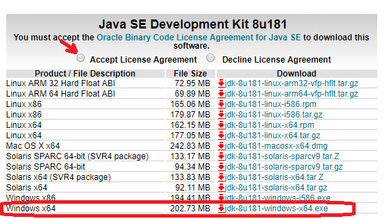
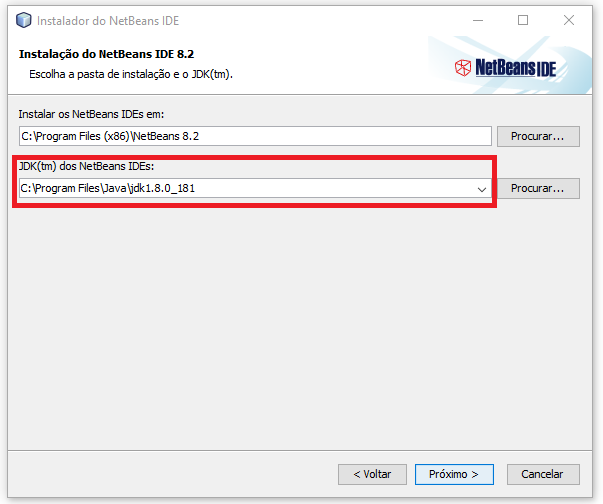

# Para Dhara
https://commonmark.org/help/

# Instalação das ferramentas

### Instalando o JDK

1. Acesse a [página de dowloads do JDK](http://www.oracle.com/technetwork/pt/java/javase/downloads/jdk8-downloads-2133151.html)
1. Encontre a versão **Java SE Development Kit 8u181**
1. Leia e aceite os termos de uso
1. Faça o download do JDK de acordo com seu sistema operacional
    
1. Ao terminar o download, execute o arquivo baixado
1. No instalador, clique em __Próximo (next)__ até finalizar a instalação. Leia os termos e aceite caso apareça algum
1. Faça agora a instalação do NetBeans

### Instalando o NetBeans

1. Acesse a [página de donwloads do NetBeans](https://netbeans.org/downloads/)
1. Faça o donwload da versão Java EE
    
1. Ao terminar o download, execute o arquivo baixado
1. No instalador, marque a opção de servidor **Apache Tomcat 8.0.27** e desmarque a outra. Clique em __Próximo (next)__
1. Leia e aceite os termos de uso
1. Aceite a pasta padrão de instalação do NetBeans e **verifique se o caminho do JDK
está correto**, caso contrário, especifique-o. Clique em __Próximo (next)__ até finalizar a instalação
    
1. Ao fim, clique em __Finalizar (Finish)__

## Instalando o WampServer
1. Acesse a [página de donwloads do NetBeans](https://netbeans.org/downloads/)

# Iniciando o primeiro projeto

## Download JSTL .jar

1. https://mvnrepository.com/artifact/org.glassfish.web/javax.servlet.jsp.jstl/1.2.1
1. https://mvnrepository.com/artifact/javax.servlet.jsp.jstl/javax.servlet.jsp.jstl-api/1.2.1
