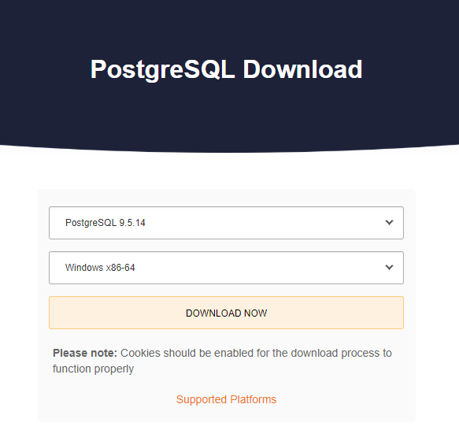
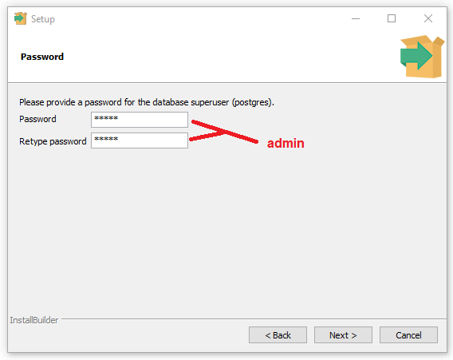
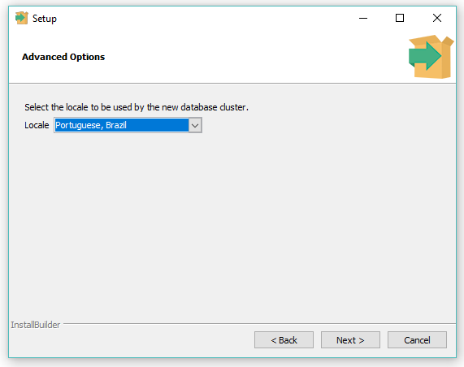
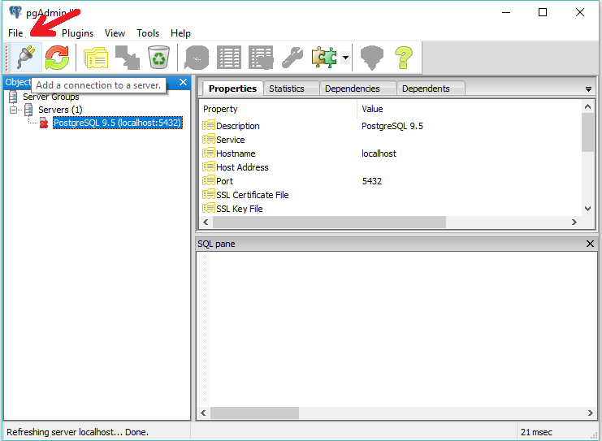
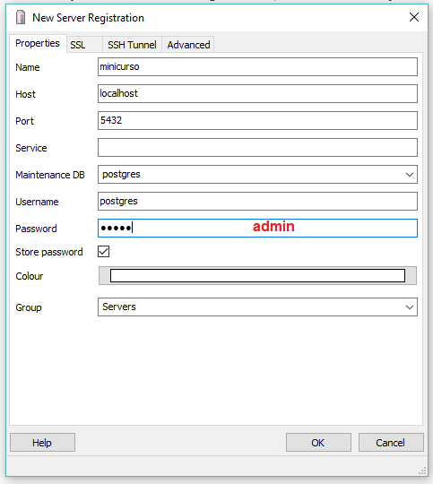
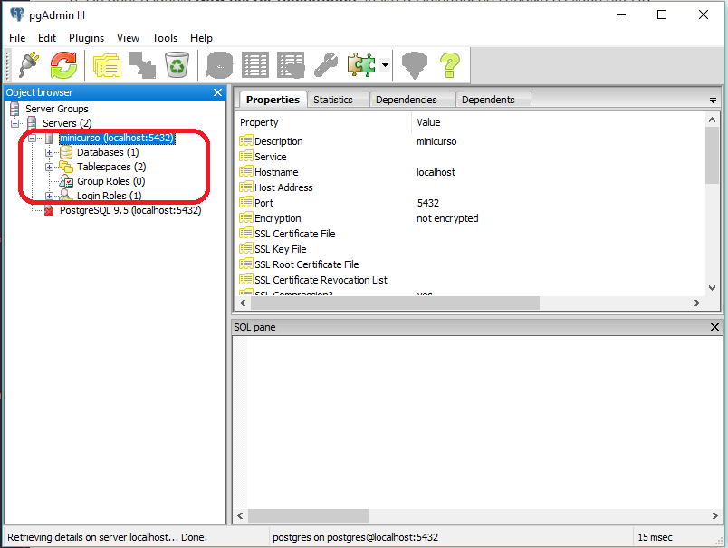

# Para Dhara
https://commonmark.org/help/

# Instalação das ferramentas

### Instalando o JDK

1. Acesse a [página de dowloads do JDK](http://www.oracle.com/technetwork/pt/java/javase/downloads/jdk8-downloads-2133151.html)
1. Encontre a versão **Java SE Development Kit 8u181**
1. Leia e aceite os termos de uso
1. Faça o download do JDK de acordo com seu sistema operacional
    
1. Ao terminar o download, execute o arquivo baixado
1. No instalador, clique em __Próximo (next)__ até finalizar a instalação. Leia os termos e aceite caso apareça algum
1. Faça agora a instalação do NetBeans

### Instalando o NetBeans

1. Acesse a [página de donwloads do NetBeans](https://netbeans.org/downloads/)
1. Faça o donwload da versão Java EE
    
1. Ao terminar o download, execute o arquivo baixado
1. No instalador, marque a opção de servidor **Apache Tomcat 8.0.27** e desmarque a outra. Clique em __Próximo (next)__
1. Leia e aceite os termos de uso
1. Aceite a pasta padrão de instalação do NetBeans e **verifique se o caminho do JDK
está correto**, caso contrário, especifique-o. Clique em __Próximo (next)__ até finalizar a instalação
    
1. Ao fim, clique em __Finalizar (Finish)__

### Instalação do PostgreSQL

1. Acesse a [página de dowloads do PostgreSQL](https://www.enterprisedb.com/downloads/postgres-postgresql-downloads)
1. Selecione a **versão 9.5.14** e seu sistema operacional, de acordo com a imagem abaixo
    
1. Ao terminar o download, execute o arquivo baixado
1. No instalador, clique em __Próximo (next)__ até chegar em **Password**
1. Insira a senha **admin** que será utilizado no **PostgreSQL** e clique em __Próximo (next)__
    

    **Obs.: GUARDE E MEMORIZE A SENHA pois será requisitada diversas vezes ao longo do curso.**
1. Na próxima etapa (Port), deixe a **porta padrão 5423** e clique em __Próximo (next)__
1. Na próxima etapa (Advanced Options), selecione o __Locale__  para **Portuguese, Brazil**

1. Clique em __Próximo (next)__ até iniciar a instalação e aguarde.
1. Ao completar a instalação **desmarque a opção Launch Stack Builder at exit**
1. Por fim, clique em __Finalizar (Finish)__

# Configurando o PostgreSQL

1. Ao instalar o PostgreSQL, o SGBD **pgAdmin III** é instalado também. Encontre o programa no menu iniciar e execute-o.
1. Ao abrir o programa, clique em **Add a connection to a server**, como na imagem abaixo:
    
1. Ao abrir a janela __New server registration__, insira as informações abaixo e clique em OK:
    

    **Obs.: A senha inserida deve ser a mesma da instalação.**
1. Caso aparece algum termo, leia-o e aceite-o.
1. Ao terminar a criação de um novo servidor, este deverá estar listado como
na imagem abaixo:
    

# Iniciando o primeiro projeto
